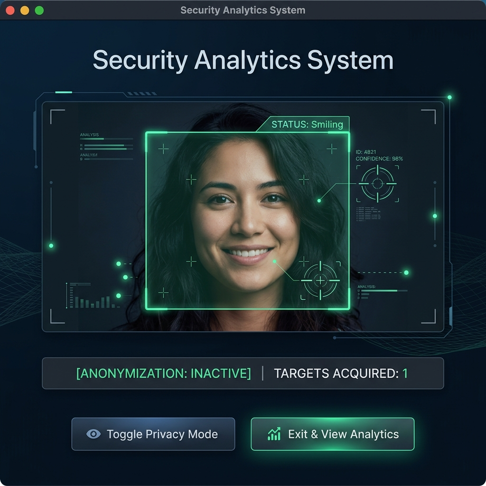

# 🛡️ Security Analytics System

[](https://www.python.org)
[](https://opencv.org)
[](https://docs.python.org/3/library/tkinter.html)

An advanced real-time computer vision security system featuring high-performance target tracking, real-time facial anonymization, micro-expression analysis, and session analytics. Built with **Python**, **OpenCV**, and **Tkinter**.

<p align="center">
  
</p>

---

## ✨ Key Features

* 🚀 **High-FPS Capture Threading:** Multi-threaded frame grabber separating camera I/O from image processing to maximize frame rates and responsiveness.
* 🎯 **EMA-Stabilized Tracking:** Advanced tracking using *Exponential Moving Average (EMA)* to completely eliminate bounding box flicker.
* 🛰️ **Cybernetic Targeting Overlay:** Aesthetic targeting reticles with crosshairs and circular tracking locks.
* 🛡️ **On-the-fly Anonymization:** Instant face pixelation privacy mode to mask subjects' identities in compliance with privacy regulations.
* 🚨 **Proximity Threshold Warnings:** Intelligent scale monitoring that triggers screen-border alerts and red visual overrides when a subject gets too close.
* 🎭 **Micro-Expression Analysis:** Real-time smile and emotion tracking utilizing Haar cascade classifiers.
* 📊 **Session Analytics:** Beautiful post-session analysis using dark-themed **Matplotlib** tracking graphs.

---

## 🔍 How It Works

### 1. Multi-Threaded Capture
The application utilizes a background `VideoCaptureThread` to continuously grab frames from the hardware camera. This separates video decoding latency from OpenCV processing and Tkinter drawing, keeping the interface fluid and responsive.

### 2. Exponential Moving Average (EMA) Tracking
To prevent face boxes from flickering due to lighting variations or momentary classifier drops, `BoxTracker` implements an EMA smoothing filter:
$$\text{Box}_{new} = \alpha \cdot \text{Box}_{detected} + (1 - \alpha) \cdot \text{Box}_{previous}$$
It also features a *Grace Frame* buffer to keep old boxes alive briefly if a detection is missed, achieving professional anti-flicker performance.

### 3. Session Analytics
When you exit the session, the accumulated detection history is visualized in a beautifully designed dark-mode area chart mapping targets acquired against active session time.

---

## 🛠️ Tech Stack & Dependencies

* **Core Language:** [Python](https://www.python.org/)
* **Computer Vision:** [OpenCV (opencv-python)](https://opencv.org/)
* **GUI Engine:** [Tkinter / ttk](https://docs.python.org/3/library/tkinter.html)
* **Analytics Visualization:** [Matplotlib](https://matplotlib.org/)
* **Image Processing & Math:** [Pillow (PIL)](https://python-pillow.org/), [NumPy](https://numpy.org/)

---

## 🚀 Quick Start

### 1. Clone the Repository
```bash
git clone https://github.com/Deep-tech-1314/security-vision-analytics.git
cd security-vision-analytics
```

### 2. Set Up Virtual Environment (Recommended)
```bash
python -m venv .venv
# On Windows:
.venv\Scripts\activate
# On macOS/Linux:
source .venv/bin/activate
```

### 3. Install Dependencies
```bash
pip install opencv-python pillow numpy matplotlib
```

### 4. Run the Application
```bash
python face_counter.py
```

---

## ⚙️ Configuration & CLI Arguments

You can customize the application behavior directly from the terminal:

| Argument | Description | Default |
| :--- | :--- | :--- |
| `--source` | Camera source ID (e.g. `0` for integrated webcams, `1` for external) | `0` |
| `--prox` | Face bounding box area threshold for proximity warning | `55000` |
| `--privacy` | Enable identity anonymization (pixelation) immediately on startup | `False` |

**Example command with customized sensitivity:**
```bash
python face_counter.py --source 0 --prox 45000 --privacy
```

---

## 🎨 Interactive Controls

* **🛡️ Toggle Privacy Mode:** Instantly switch face pixelation on and off.
* **⛔ Exit & View Analytics:** Cleanly terminates camera threads, releases hardware resources, and triggers the post-session graph showing tracked targets over time.
